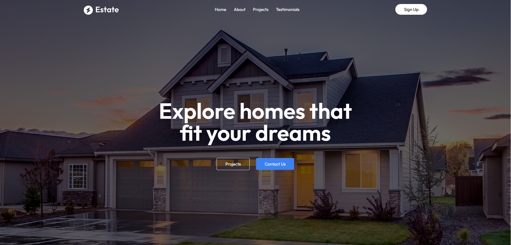
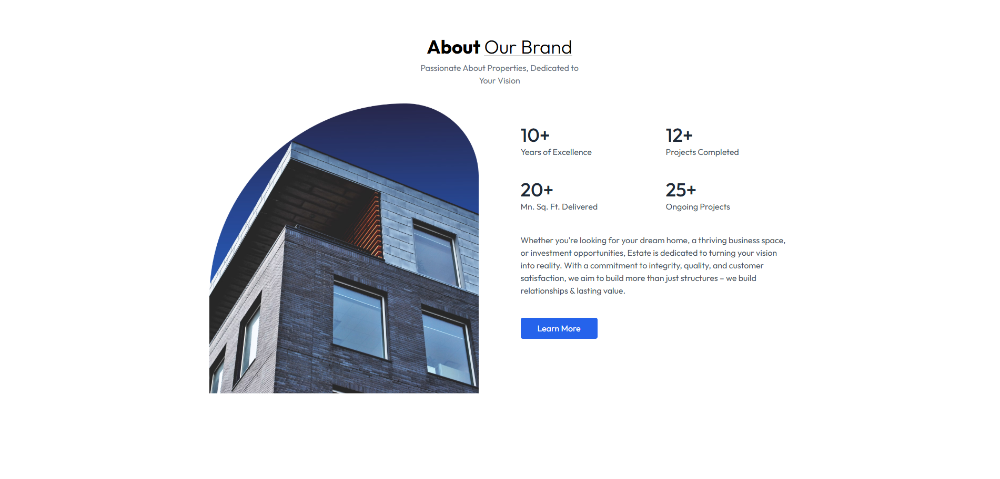
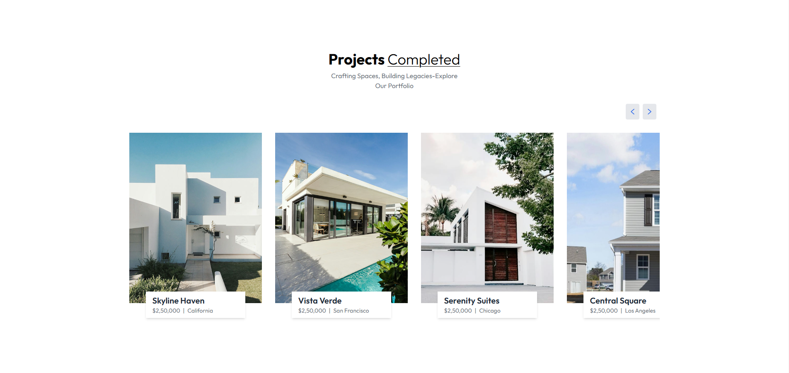
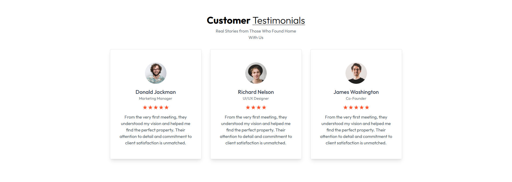
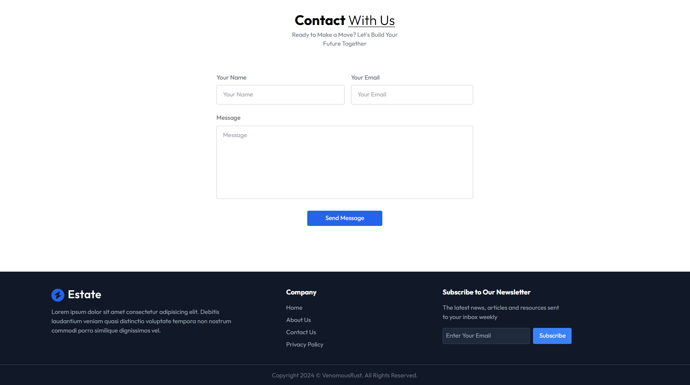

# Project Name

Real Estate Website

## Description

This website is built using HTML5, TailwindCSS, JavaScript and React, it offers a modern and visually appealing user experience. The website features an "About Our Brand" section highlighting the company's achievements and values, a "Projects Completed" portfolio showcasing successful developments with pricing and locations, and a "Customer Testimonials" section that builds trust by sharing positive client experiences. With a clean, responsive design and smooth navigation, the website effectively communicates with the brand's commitment to excellence and customer satisfaction in the real estate sector.

## Screenshots

## Technologies Used

- HTML5
- TailwindCSS
- JavaScript
- React

## Contact

[Rizwan Siddiqui](https://github.com/RizwanSiddiqui021) - [rizwansiddiqui021@gmail.com](mailto:rizwansiddiqui021@gmail.com)
